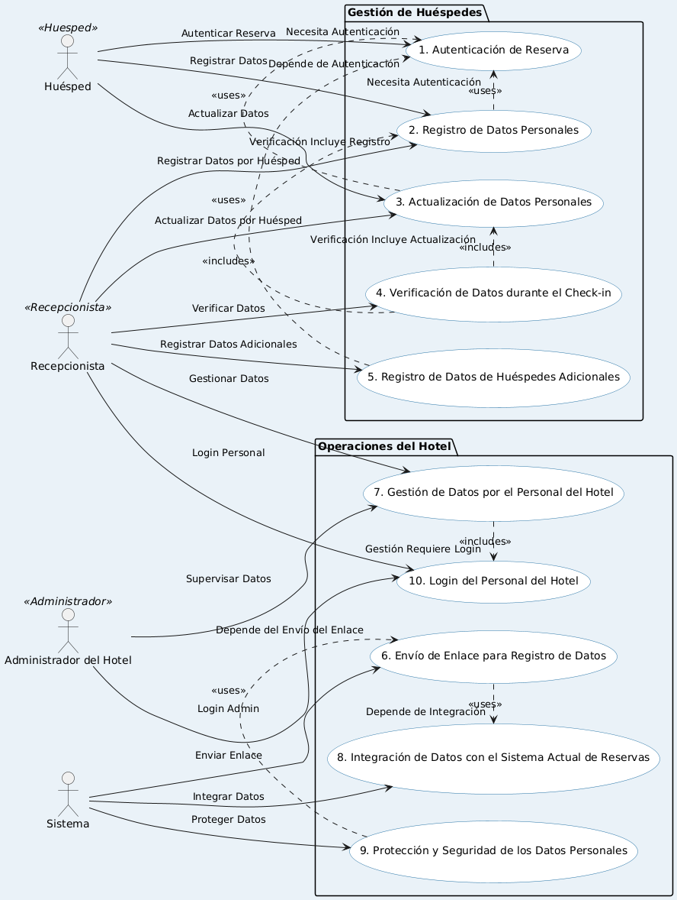
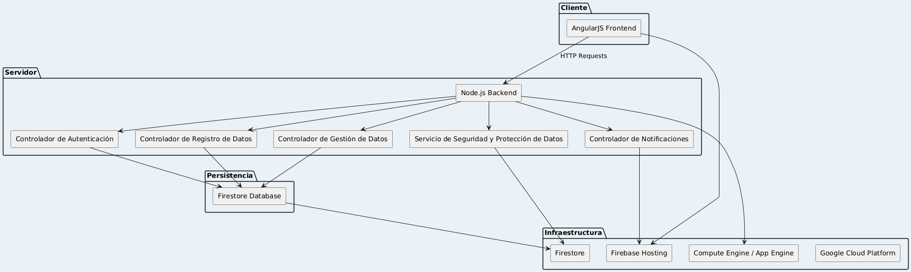
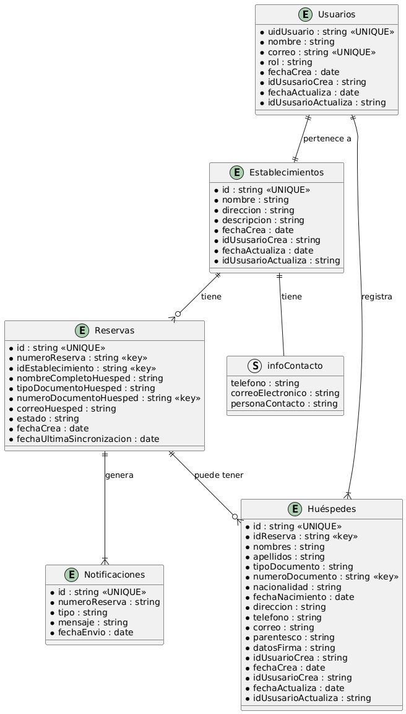

## Índice

0. [Ficha del proyecto](#0-ficha-del-proyecto)
1. [Descripción general del producto](#1-descripción-general-del-producto)
2. [Arquitectura del sistema](#2-arquitectura-del-sistema)
3. [Modelo de datos](#3-modelo-de-datos)
4. [Especificación de la API](#4-especificación-de-la-api)
5. [Historias de usuario](#5-historias-de-usuario)
6. [Tickets de trabajo](#6-tickets-de-trabajo)
7. [Pull requests](#7-pull-requests)

---

## 0. Ficha del proyecto

### **0.1. Tu nombre completo:**
Zulma Johanna Jaimes Calvete

### **0.2. Nombre del proyecto:**
RD Check-IN
Registro de datos para checkin

### **0.3. Descripción breve del proyecto:**

### **0.4. URL del proyecto:**

> Puede ser pública o privada, en cuyo caso deberás compartir los accesos de manera segura. Puedes enviarlos a [alvaro@lidr.co](mailto:alvaro@lidr.co) usando algún servicio como [onetimesecret](https://onetimesecret.com/).

### 0.5. URL o archivo comprimido del repositorio

> Puedes tenerlo alojado en público o en privado, en cuyo caso deberás compartir los accesos de manera segura. Puedes enviarlos a [alvaro@lidr.co](mailto:alvaro@lidr.co) usando algún servicio como [onetimesecret](https://onetimesecret.com/). También puedes compartir por correo un archivo zip con el contenido

---

## 1. Descripción general del producto

### **1.1. Objetivo:**

El propósito de este producto es crear una aplicación web que permita a los hoteles en Colombia mejorar su proceso de registro de datos de huéspedes durante el check-in, cumpliendo con las exigencias legales del país. La aplicación web facilitará a los huéspedes la posibilidad de ingresar y registrar sus datos personales antes de su llegada al hotel, reduciendo demoras, errores de registro y molestias durante el proceso de check-in. 

### Valor Aportado

- **Para los Huéspedes:** Simplifica el proceso de check-in, permitiendo que ingresen y  actualicen sus datos personales en cualquier momento antes de su llegada, evitando repeticiones de información innecesarias.
- **Para el Hotel:** Mejora la eficiencia operativa durante el check-in al reducir el tiempo de procesamiento, minimizar errores en el registro de datos y cumplir con las normativas legales de protección de datos personales y Turismo. 
- **Para el Mercado Potencial:** Esta solución puede extenderse a otros tipos de negocios que requieren registros de datos tipo check-in (reservas en zonas sociales de conjuntos residenciales, eventos, etc.), ampliando el mercado objetivo y generando oportunidades de crecimiento del producto.

### **1.2. Características y funcionalidades principales:**

1. **Autenticación de Reserva:**
   - Los huéspedes ingresan a la web usando el número de reserva y su documento de identidad para autenticarse.
   
2. **Formulario de Registro/Actualización de Datos:**
   - Permite a los huéspedes registrar o actualizar sus datos personales antes del check-in.
   - Incluye campos obligatorios según la normativa colombiana: nombre completo, tipo y número de documento de identidad, nacionalidad, fecha de nacimiento, dirección de residencia, número de contacto, y correo electrónico.

3. **Validación de Datos durante Check-in:**
   - El recepcionista verifica los datos registrados con los documentos de identidad físicos presentados por los huéspedes.
   - Posibilidad de editar o actualizar los datos en caso de discrepancias.

4. **Manejo de Reservas Múltiples:**
   - Funcionalidad para registrar los datos de todos los huéspedes asociados a una misma reserva.

5. **Notificaciones Automatizadas:**
   - Envío de un email con un enlace al formulario de registro de datos una vez se confirma la reserva en el sistema actual del hotel.

6. **Interfaz de Gestión para el Hotel:**
   - Panel administrativo donde el personal del hotel puede consultar, editar y gestionar los datos de los huéspedes.

7. **Seguridad y Protección de Datos:**
   - Implementación de medidas de seguridad y privacidad conforme a la Ley 1581 de 2012 de Protección de Datos Personales en Colombia.

8. **Escalabilidad para Otros Tipos de Negocios:**
   - Diseño modular y adaptable para permitir su evolución hacia otros negocios que requieran registro de datos en reservas de tipo check-in.

9. **Integración con el Sistema Actual de Reservas:**
   - Sistema de integración para recibir el número de reserva y generar el enlace al formulario sin cambiar el sistema actual de registro en Excel.

10. **Despliegue en la Nube:**
    - Implementación en Google Cloud Platform para asegurar disponibilidad, escalabilidad y rendimiento del producto.

### **Casos de uso:**

### Descripción Detallada de los Casos de Uso

#### Roles de Usuario

1. **Huésped:** Persona que tiene una reserva en el hotel y necesita registrar o actualizar sus datos personales.
2. **Recepcionista:** Miembro del personal del hotel responsable de gestionar el proceso de check-in y verificar los datos de los huéspedes.
3. **Administrador del Hotel:** Personal del hotel con permisos administrativos para gestionar y supervisar los datos y operaciones del sistema.
4. **Sistema:** Componente automatizado que ejecuta tareas como el envío de correos electrónicos o la integración de datos.

#### Caso de Uso 1: Autenticación de Reserva
- **Roles de Usuario:** Huésped
- **Acciones:**
  - El huésped ingresa a la página web.
  - Introduce su número de reserva y el número de documento de identidad.
  - El sistema valida si estos datos coinciden con una reserva existente.
- **Dependencias:**
  - Requiere que la reserva haya sido registrada previamente en el sistema actual del hotel (Excel).
  - Si los datos coinciden, permite el acceso al formulario de registro o actualización de datos personales.

#### Caso de Uso 2: Registro de Datos Personales
- **Roles de Usuario:** Huésped, Recepcionista
- **Acciones:**
  - **Huésped:** Una vez autenticado, completa el formulario con sus datos personales obligatorios (nombre completo, tipo y número de documento de identidad, nacionalidad, fecha de nacimiento, dirección de residencia, número de contacto, correo electrónico) y proporciona su firma digital.
  - **Recepcionista:** Si el huésped no ha registrado sus datos antes de su llegada, el recepcionista realiza el registro durante el check-in ingresando los datos personales del huésped en el sistema.
- **Dependencias:**
  - Requiere autenticación exitosa en el sistema (Caso de Uso 1).
  - Los datos deben ser validados y almacenados correctamente para uso durante el check-in.

#### Caso de Uso 3: Actualización de Datos Personales
- **Roles de Usuario:** Huésped, Recepcionista
- **Acciones:**
  - **Huésped:** Una vez autenticado, accede al formulario para actualizar cualquier dato personal previamente registrado.
  - **Recepcionista:** Durante el check-in o en cualquier otro momento, puede actualizar los datos personales del huésped si hay discrepancias o si se requieren modificaciones.
- **Dependencias:**
  - Requiere autenticación del huésped (Caso de Uso 1) o del recepcionista (Caso de Uso 10).
  - La actualización debe realizarse antes de finalizar el check-in o según sea necesario para mantener la precisión de los datos.

#### Caso de Uso 4: Verificación de Datos durante el Check-in
- **Roles de Usuario:** Recepcionista
- **Acciones:**
  - Durante el check-in, el recepcionista accede a la aplicación web para consultar los datos registrados por el huésped.
  - Verifica estos datos contra los documentos de identidad físicos presentados por el huésped.
  - Puede editar o actualizar los datos en caso de discrepancias.
- **Dependencias:**
  - Requiere que el huésped haya completado previamente el registro o actualización de datos (Casos de Uso 2 o 3).
  - Requiere que el recepcionista esté autenticado en el sistema (Caso de Uso 10).

#### Caso de Uso 5: Registro de Datos de Huéspedes Adicionales en la Reserva
- **Roles de Usuario:** Huésped, Recepcionista
- **Acciones:**
  - Si una reserva tiene más de un huésped, el sistema permite al huésped o al recepcionista ingresar los datos personales de todos los huéspedes asociados a dicha reserva.
- **Dependencias:**
  - Requiere autenticación del huésped (Caso de Uso 1) o del recepcionista (Caso de Uso 10).
  - Depende de la existencia de una reserva válida con múltiples huéspedes.

#### Caso de Uso 6: Envío de Enlace para Registro de Datos
- **Roles de Usuario:** Sistema, Personal del hotel
- **Acciones:**
  - Automáticamente, una vez que se confirma una reserva en el sistema de gestión actual del hotel, el sistema envía un correo electrónico al huésped principal con un enlace al formulario de registro de datos personales.
  - Alternativamente, el personal del hotel puede enviar el enlace de forma manual.
- **Dependencias:**
  - Requiere que la reserva haya sido registrada previamente en el sistema actual del hotel (Excel).
  - El correo electrónico depende de una dirección de correo válida proporcionada al hotel.

#### Caso de Uso 7: Gestión de Datos por el Personal del Hotel
- **Roles de Usuario:** Recepcionista, Administrador del Hotel
- **Acciones:**
  - A través de un panel administrativo, el personal del hotel puede consultar, editar, y gestionar los datos personales de los huéspedes registrados.
  - También puede registrar datos si el huésped no lo ha hecho previamente.
- **Dependencias:**
  - Requiere autenticación del personal (Caso de Uso 10).
  - Requiere que existan reservas registradas en el sistema.

#### Caso de Uso 8: Integración de Datos con el Sistema Actual de Reservas
- **Roles de Usuario:** Sistema
- **Acciones:**
  - La aplicación web se conecta al sistema actual de reservas (Excel) para recibir los números de reserva y generar enlaces al formulario de registro de datos.
- **Dependencias:**
  - Requiere acceso y sincronización con el sistema de reservas en Excel.

#### Caso de Uso 9: Protección y Seguridad de los Datos Personales
- **Roles de Usuario:** Sistema
- **Acciones:**
  - El sistema aplica medidas de seguridad y privacidad para proteger los datos personales de los huéspedes.
- **Dependencias:**
  - Requiere configuración adecuada de las políticas de seguridad y privacidad.

#### Caso de Uso 10: Login del Personal del Hotel
- **Roles de Usuario:** Recepcionista, Administrador del Hotel
- **Acciones:**
  - El personal del hotel ingresa a la aplicación web utilizando un nombre de usuario y una contraseña.
  - El sistema valida las credenciales proporcionadas y permite el acceso al panel de gestión de datos.
- **Dependencias:**
  - Requiere que el usuario tenga credenciales válidas registradas en el sistema.
  - Es necesario para acceder a cualquier funcionalidad administrativa o de gestión de datos (Casos de Uso 4 y 7).

### **1.3. Diseño y experiencia de usuario:**

> Proporciona imágenes y/o videotutorial mostrando la experiencia del usuario desde que aterriza en la aplicación, pasando por todas las funcionalidades principales.

### **1.4. Instrucciones de instalación:**
> Documenta de manera precisa las instrucciones para instalar y poner en marcha el proyecto en local (librerías, backend, frontend, servidor, base de datos, migraciones y semillas de datos, etc.)

---

## 2. Arquitectura del Sistema

### **2.1. Diagrama de arquitectura:**

#### Patrón de Arquitectura: MVC (Modelo-Vista-Controlador)
La aplicación sigue un patrón de arquitectura **MVC**, una arquitectura simple propia de un MVP, pero que sigue siendo flexible y escalable para futuras mejoras, y que además está alineada con el stack tecnológico definido en los requisitos.  

La capa **Modelo (Model)** encapsula la lógica de negocio y los datos; incluye la interacción con la base de datos **Firestore** y las operaciones relacionadas con los datos de huéspedes, reservas, etc.
   
La capa **Vista (View)** se encarga de la presentación de la interfaz de usuario, tanto de entrada como de salida; el **Frontend** desarrollado con **AngularJS** actúa como la **Vista**, proporcionando una interfaz interactiva y dinámica para los usuarios.

La capa **Controlador (Controller)** gestiona la comunicación entre el Modelo y la Vista; los controladores del **Backend** desarrollado con **Node.js** manejan las solicitudes HTTP, procesan la lógica de negocio, y devuelven respuestas al cliente.

#### Justificación de la Elección del Patrón MVC

1. **Simplicidad y Rapidez de Implementación:**
   - MVC es un patrón bien conocido y ampliamente utilizado en el desarrollo web, lo que facilita su implementación rápida, especialmente en un MVP donde el tiempo es crucial.

2. **Desarrollo Desacoplado:**
   - Permite separar claramente la lógica de presentación (Frontend) de la lógica de negocio (Backend), lo que facilita el trabajo simultáneo de equipos de desarrollo en diferentes componentes.

3. **Facilidad de Escalabilidad y Mantenimiento:**
   - Al dividir la aplicación en componentes independientes, es más fácil escalar cada parte de manera individual y realizar mantenimientos o cambios en un componente sin afectar directamente a los demás.

4. **Compatibilidad con el Stack:**
   - Se alinea bien con el stack definido entre los requisitos no funcionales (AngularJS para el Frontend y Node.js para el Backend), aprovechando las fortalezas de ambos en sus respectivos roles.

#### Beneficios del Patrón MVC para el Proyecto

1. **Modularidad y Reusabilidad:**
   - Cada componente del patrón (Modelo, Vista, Controlador) puede ser desarrollado, probado, y mantenido de manera independiente, promoviendo la modularidad y la reutilización del código.

2. **Facilita el Trabajo en Equipo:**
   - La separación de responsabilidades permite que los desarrolladores de Frontend y Backend trabajen en paralelo sin interferencias, mejorando la eficiencia del equipo.

3. **Mejora la Experiencia del Usuario:**
   - Con AngularJS manejando la **Vista**, podemos crear una interfaz de usuario más interactiva y receptiva, mejorando la experiencia del usuario.

4. **Flexibilidad para Escalar:**
   - La arquitectura MVC facilita la evolución del MVP hacia un producto más robusto y completo al permitir agregar nuevas funcionalidades o modificar las existentes sin necesidad de una reescritura completa del código.

#### Desventajas del Patrón MVC

1. **Complejidad Inicial de Configuración:**
   - Aunque es relativamente sencillo, MVC puede requerir una configuración inicial más detallada en comparación con arquitecturas más monolíticas, especialmente cuando se utiliza con frameworks modernos como AngularJS y Node.js.

2. **Manejo de Estados Complejos:**
   - En aplicaciones muy dinámicas o con necesidades de sincronización en tiempo real muy complejas, MVC puede no ser tan eficiente como una arquitectura basada en eventos, que maneja los estados de forma más reactiva.

3. **Dependencia del Frontend y Backend:**
   - Aunque se beneficia de la separación de responsabilidades, la arquitectura MVC puede crear dependencias entre las API del backend y la lógica de presentación del frontend, lo que requiere coordinación constante entre ambos equipos.

### **2.2. Descripción de componentes principales:**

#### Cliente (Frontend)

- **AngularJS Frontend:** Interfaz de usuario donde los huéspedes y el personal del hotel interactúan con la aplicación.  Contempla los componentes: 
    - **Componente de Autenticación de Huéspedes**: Maneja el inicio de sesión del huésped mediante número de reserva y documento de identidad.
    - **Componente de Formulario de Registro/Actualización de Datos**: Permite a los huéspedes ingresar y actualizar sus datos personales.
    - **Componente de Check-in de Recepcionista**: Permite al recepcionista verificar, registrar y actualizar datos durante el check-in.
    
    - **Panel Administrativo**: Interfaz para el personal del hotel, con capacidades para gestionar datos de huéspedes y supervisar procesos.

#### Servidor (Backend)

- **Node.js Backend:** Servidor principal que maneja la lógica de negocio y se organiza en varios controladores:
  - **Controlador de Autenticación:** Maneja el login de los huéspedes y del personal del hotel.
  - **Controlador de Registro de Datos:** Gestiona el registro y actualización de datos personales.
  - **Controlador de Gestión de Datos:** Proporciona funciones de administración para el personal del hotel.
  - **Controlador de Notificaciones:** Envía notificaciones por correo electrónico o mensajes.
  - **Servicio de Seguridad y Protección de Datos:** Asegura el cumplimiento de la normativa de protección de datos.

#### Persistencia

- **Firestore Database:** Base de datos NoSQL utilizada para almacenar los datos de los huéspedes, registros de check-in, etc.

#### Infraestructura

- **Google Cloud Platform (GCP):** Proveedor de nube que incluye:
  - **Firebase Hosting:** Para el alojamiento del frontend de AngularJS.
  - **Firestore:** Servicio de base de datos en tiempo real.
  - **Compute Engine / App Engine:** Para ejecutar el backend en un entorno escalable y seguro.

### **2.3. Descripción de alto nivel del proyecto y estructura de ficheros**

> Representa la estructura del proyecto y explica brevemente el propósito de las carpetas principales, así como si obedece a algún patrón o arquitectura específica.

### **2.4. Infraestructura y despliegue**

> Detalla la infraestructura del proyecto, incluyendo un diagrama en el formato que creas conveniente, y explica el proceso de despliegue que se sigue

### **2.5. Seguridad**

> Enumera y describe las prácticas de seguridad principales que se han implementado en el proyecto, añadiendo ejemplos si procede

### **2.6. Tests**

> Describe brevemente algunos de los tests realizados

---

## 3. Modelo de Datos

### **3.1. Diagrama del modelo de datos:**

### **3.2. Descripción de entidades principales:**

A continuación, se describen con detalle cada una de las colecciones en la base de datos, los campos asociados, las validaciones aplicadas, y las relaciones entre las colecciones.

### Descripción Detallada del Diagrama de Modelo de Documentos

A continuación se describe en detalle las colecciones más importantes, los campos asociados, las validaciones aplicadas, y las relaciones entre  colecciones.

#### **1. Reservas (`Reservas`)**
- **Descripción:** Contiene información básica de la reserva importada del sistema externo y se utiliza para gestionar el registro de datos de los huéspedes.
- **Campos:**
  - `id`: string, Identificador único de la reserva. (**UNIQUE**)
  - `numeroReserva`: string, Número de reserva proporcionado por el sistema externo. (**KEY**)
  - `idEstablecimiento`: string, Identificador del establecimiento al que pertenece la reserva. (**KEY**)
    - **Reglas de Validación:** Debe existir en la colección **Establecimientos**.
  - `nombreCompletoHuesped`: string, Nombre completo del huésped principal.
  - `tipoDocumentoHuesped`: string, Tipo de documento del huésped principal.
    - **Reglas de Validación:** Debe ser uno de los valores permitidos: `'RC'`, `'CC'`, `'TI'`, `'PAS'`, `'CE'`, `'PEP'`.
  - `numeroDocumentoHuesped`: string, Número del documento de identificación del huésped principal. (**KEY**)
  - `correoHuesped`: string, Correo electrónico del huésped principal.
    - **Reglas de Validación:** Debe ser un string con un formato de correo electrónico válido, con un tamaño máximo de 256 caracteres.
  - `estado`: string, Estado de la reserva.
    - **Reglas de Validación:** Debe ser uno de los valores permitidos: `'abierta'`, `'cerrada'`, `'cancelada'`.
  - `fechaCrea`: date, Fecha de creación del registro.
  - `fechaUltimaSincronizacion`: date, Fecha de la última sincronización con el sistema externo.

#### **2. Huéspedes (`Huespedes`)**
- **Descripción:** Representa la información detallada que los huéspedes deben registrar en el check-in.
- **Campos:**
  - `id`: string, Identificador único del huésped. (**UNIQUE**)
  - `idReserva`: string, Identificador de la reserva asociada. (**KEY**)
    - **Reglas de Validación:** Debe existir en la colección **Reservas**.
  - `nombres`: string, Nombres del huésped.
    - **Reglas de Validación:** Debe ser un string, con un tamaño máximo de 100 caracteres.
  - `apellidos`: string, Apellidos del huésped.
    - **Reglas de Validación:** Debe ser un string, con un tamaño máximo de 100 caracteres.
  - `tipoDocumento`: string, Tipo de documento del huésped.
    - **Reglas de Validación:** Debe ser uno de los valores permitidos: `'RC'`, `'CC'`, `'TI'`, `'PAS'`, `'CE'`, `'PEP'`.
  - `numeroDocumento`: string, Número del documento de identificación del huésped. (**KEY**)
    - **Reglas de Validación:** Debe ser un string, con un tamaño máximo de 20 caracteres.
  - `nacionalidad`: string, Nacionalidad del huésped.
    - **Reglas de Validación:** Debe ser un string, con un tamaño máximo de 50 caracteres.
  - `fechaNacimiento`: date, Fecha de nacimiento del huésped.
    - **Reglas de Validación:** Debe ser un valor de tipo fecha.
  - `direccion`: string, Dirección del huésped.
    - **Reglas de Validación:** Debe ser un string, con un tamaño máximo de 255 caracteres.
  - `telefono`: string, Teléfono de contacto del huésped.
    - **Reglas de Validación:** Debe ser un string, con un tamaño máximo de 20 caracteres.
  - `correo`: string, Correo electrónico del huésped.
    - **Reglas de Validación:** Debe ser un string con un formato de correo electrónico válido, con un tamaño máximo de 256 caracteres.
  - `parentesco`: string, Relación con el adulto que acompaña al huésped menor de edad.
    - **Reglas de Validación:** Debe ser un string.
  - `datosFirma`: string, Representación de la firma digital del huésped.
    - **Reglas de Validación:** Debe ser un string.
  - `idUsuarioCrea`: string, Identificador del usuario que registró los datos del huésped.
    - **Reglas de Validación:** Debe existir en la colección **Usuarios**.
  - `fechaCrea`: date, Fecha de creación del registro.
  - `idUsusarioCrea`: string, Identificador del usuario que creó el registro.
    - **Reglas de Validación:** Debe existir en la colección **Usuarios**.
  - `fechaActualiza`: date, Fecha de la última actualización del registro.
  - `idUsusarioActualiza`: string, Identificador del usuario que actualizó el registro.
    - **Reglas de Validación:** Debe existir en la colección **Usuarios**.

#### **3. Establecimientos (`Establecimientos`)**
- **Descripción:** Representa los hoteles o establecimientos que utilizan la aplicación.
- **Campos:**
  - `id`: string, Identificador único del establecimiento. (**UNIQUE**)
  - `nombre`: string, Nombre del establecimiento.
    - **Reglas de Validación:** Debe ser un string, con un tamaño máximo de 255 caracteres.
  - `direccion`: string, Dirección del establecimiento.
    - **Reglas de Validación:** Debe ser un string, con un tamaño máximo de 255 caracteres.
  - `descripcion`: string, Descripción del establecimiento.
    - **Reglas de Validación:** Debe ser un string, con un tamaño máximo de 500 caracteres.
  - `infoContacto`: object, Información de contacto del establecimiento.
    - **Estructura Interna:**
      - `telefono`: string, Teléfono de contacto del establecimiento.
        - **Reglas de Validación:** Debe ser un string, con un tamaño máximo de 20 caracteres.
      - `correoElectronico`: string, Correo electrónico del establecimiento.
        - **Reglas de Validación:** Debe ser un string con un formato de correo electrónico válido, con un tamaño máximo de 256 caracteres.
      - `personaContacto`: string, Nombre de la persona de contacto principal en el establecimiento.
        - **Reglas de Validación:** Debe ser un string, con un tamaño máximo de 100 caracteres.
  - `fechaCrea`: date, Fecha de creación del registro.
  - `idUsusarioCrea`: string, Identificador del usuario que creó el registro.
    - **Reglas de Validación:** Debe existir en la colección **Usuarios**.
  - `fechaActualiza`: date, Fecha de la última actualización del registro.
  - `idUsusarioActualiza`: string, Identificador del usuario que actualizó el registro.
    - **Reglas de Validación:** Debe existir en la colección **Usuarios**.

#### **4. Usuarios (`Usuarios`)**
- **Descripción:** Representa a los usuarios que se loguean en el sistema.
- **Campos:**
  - `uidUsuario`: string, Identificador único generado por Firebase Authentication. (**UNIQUE**)
    - **Reglas de Validación:** Es un string generado automáticamente por Firebase Authentication.
  - `nombre`: string, Nombre completo del usuario.
    - **Reglas de Validación:** Debe ser un string, con un tamaño máximo de 100 caracteres.
  - `correo`: string, Correo electrónico del usuario. (**UNIQUE**)
    - **Reglas de Validación:** Debe ser un string con un formato de correo electrónico válido, con un tamaño máximo de 256 caracteres.
  - `rol`: string, Rol del usuario (puede ser "huesped", "recepcionista" o "administrador_hotel").
    - **Reglas de Validación:** Debe ser uno de los valores permitidos: `'huesped'`, `'recepcionista'`, `'administrador_hotel'`.
  - `fechaCrea`: date, Fecha de creación del registro.
  - `idUsusarioCrea`: string, Identificador del usuario que creó el registro.
    - **Reglas de Validación:** Debe existir en la colección **Usuarios**.
  - `fechaActualiza`: date, Fecha de la última actualización del registro.
  - `idUsusarioActualiza`: string, Identificador del usuario que actualizó el registro.
    - **Reglas de Validación:** Debe existir en la colección **Usuarios**.

#### 5**. Notificaciones (`Notificaciones`)**
- **Descripción:** Almacena las notificaciones enviadas a los huéspedes, como invitaciones para completar su registro de datos.
- **Campos:**
  - `id`: string, Identificador único de la notificación. (**UNIQUE**)
  - `numeroReserva`: string, Número de la reserva a la que está asociada la notificación.
    - **Reglas de Validación:** Debe existir en la colección **Reservas**.
  - `tipo`: string, Tipo de notificación.
    - **Reglas de Validación:** Debe ser uno de los valores permitidos: `'invitacion_checkin'`.
  - `mensaje`: string, Contenido del mensaje de la notificación.
    - **Reglas de Validación:** Debe ser un string, con un tamaño máximo de 500 caracteres.
  - `fechaEnvio`: date, Fecha y hora en que se envió la notificación.

---

## 4. Especificación de la API

No aplica.

---

## 5. Historias de Usuario

> Documenta 3 de las historias de usuario principales utilizadas durante el desarrollo, teniendo en cuenta las buenas prácticas de producto al respecto.

**Historia de Usuario 1**

**Historia de Usuario 2**

**Historia de Usuario 3**

---

## 6. Tickets de Trabajo

> Documenta 3 de los tickets de trabajo principales del desarrollo, uno de backend, uno de frontend, y uno de bases de datos. Da todo el detalle requerido para desarrollar la tarea de inicio a fin teniendo en cuenta las buenas prácticas al respecto. 

**Ticket 1**

**Ticket 2**

**Ticket 3**

---

## 7. Pull Requests

> Documenta 3 de las Pull Requests realizadas durante la ejecución del proyecto

**Pull Request 1**

**Pull Request 2**

**Pull Request 3**

